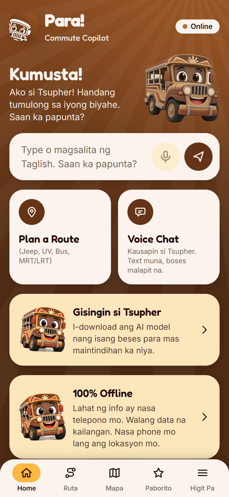
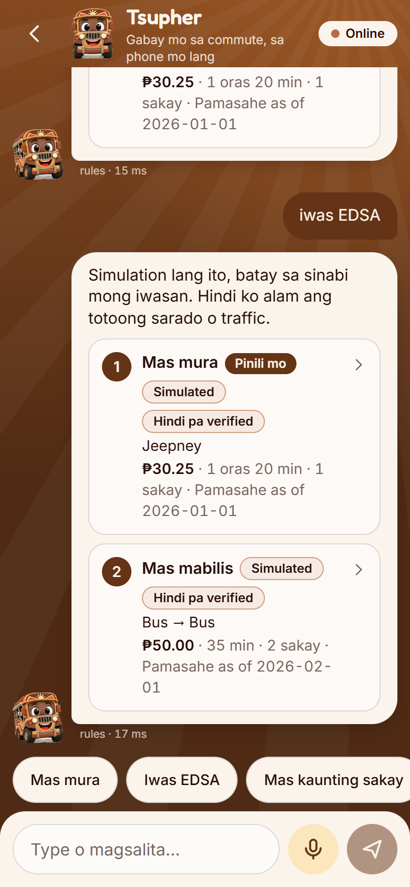
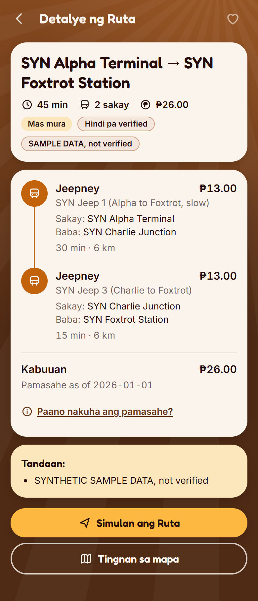
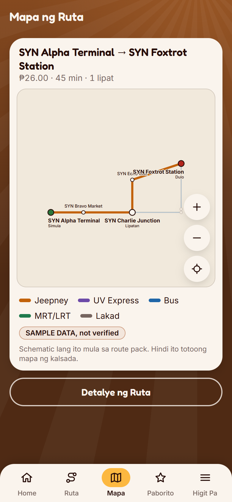
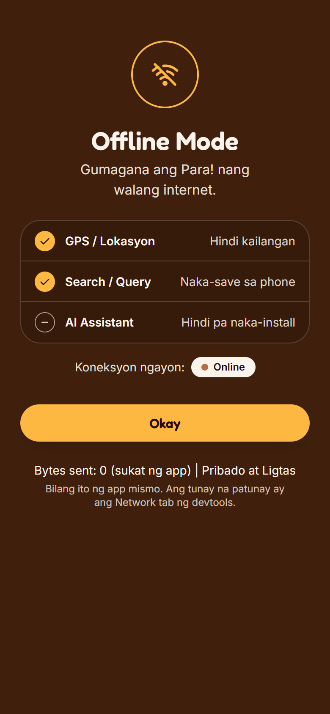
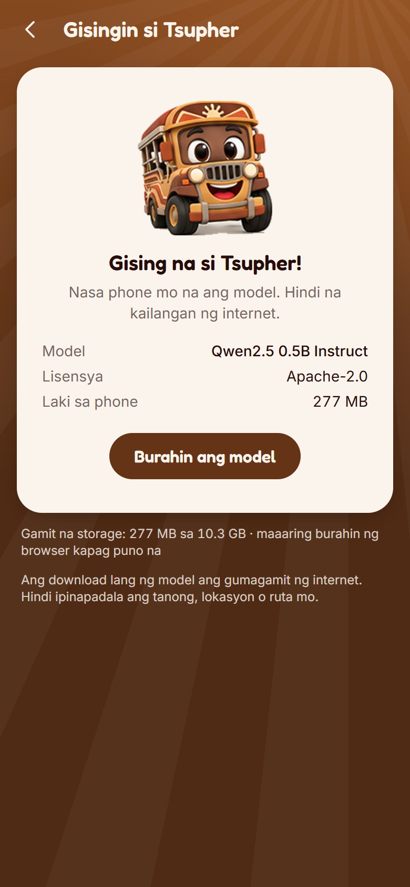

# Para! Offline Commute Copilot

Para! is a Taglish commute helper that keeps working with no signal. **The route and fare data in this build are a labeled synthetic sample network (made-up places, routes and fares, not a real corridor); no real route, terminal or fare is included, and every result says "SAMPLE DATA".** You ask where you want to go; Tsupher, the jeepney mascot, shows route options, where to board and alight, and a fare breakdown with an "as of" date. You can follow up ("may mas mura?") and declare what-ifs ("iwas EDSA"). It is a web app (PWA): after one visit it runs in airplane mode, and nothing you type leaves the device.

| Home | Chat | Route detail |
|---|---|---|
|  |  |  |

| Schematic map | Offline Mode (proof panel) | Model setup |
|---|---|---|
|  |  |  |

More in `docs/screenshots/`. The screenshots show the synthetic sample data described below.

Team **git inet**: Daniel Aldreen Manjares, Justine Catapang, Elijah Emmanuel. Project name: Para! Offline Commute Copilot. Submission answers: `docs/SUBMISSION_FORM.md`. Demo checklist: `docs/DEMO_PREFLIGHT.md`.

## What is deterministic and what is AI

```
        Understand                    Plan                         Explain
   (rules, then local AI)      (deterministic, local)         (templates, local)

 "Paano pumunta sa X      ->   Router: graph search over   ->   Taglish steps and
  galing Y? iwas EDSA"         the route pack + fare table      summary built from
                               + avoid-list                     the route result
        |                             |                              |
  Intent {origin, destination,   RouteResult {legs, fares,     Text and cards on screen
  preference, avoid}             minutes, as-of date,
                                 simulated, unverified}
```

| Part | How it works | Can it invent a route or a fare? |
|---|---|---|
| Reading the question, rules lane | Fuzzy matching against landmark names and aliases, plus Tagalog and English cue words. Always tried first. | No. It can only pick landmarks that exist in the route pack. If something is missing or unclear, it asks. |
| Reading the question, AI lane | A small language model running in the browser (WebLLM on WebGPU), used only when the rules cannot finish. Its output is limited to names from the route pack and is checked again before use. | No. A place that is not in the pack is dropped, and the app asks instead. |
| Routes, transfers, travel time | Dijkstra search in a Web Worker (`src/router/`). Same input, same output, every time. | No. |
| Fares | `base fare + (distance beyond the base distance x per-km rate)`, then the fare table's rounding rule. Every number comes from the fare table in the route pack. | No. |
| What-ifs ("iwas EDSA", "sarado ang X") | The rider's own constraint, added to the router's avoid-list. Results are labeled "Simulated". | No. The app does not know real traffic or closures and says so. |
| Explanations | Sentence templates filled from the route result. | No. |
| AI-written summaries | Built, with a validator that rejects any number or place not in the route result, but **switched off**: in real runs they were slow and never passed. | It cannot reach the screen without passing the validator. |

## Honest limits

- **The app plans no trips yet.** The real data is rail only: station-to-station fares for LRT-1, LRT-2 and MRT-3 (transcribed from the operators' matrices, dated on screen) and the stations' OpenStreetMap coordinates. There are no road routes, ride times or terminals, so the Ruta tab is a fare lookup and the chat answers "how much from A to B" for two stations on one line. Q City Bus has stop names but no measured coordinates or times; see `docs/DATA_COLLECTION.md`. The synthetic sample network ("SYN Alpha Terminal"...) is kept for tests and for `npm run build:sample`; it is labeled "SAMPLE DATA, not verified".
- **Not tested on a phone.** Everything was verified in desktop Chrome, mostly headless. `docs/IOS_NOTES.md` lists what to check on iOS; none of it has been checked.
- **The AI model needs WebGPU and a large one-time download** (277 MB to 926 MB). Without it the app still works through the rules lane.
- **The model has not been shown to help.** On the current 50-query test set the rules alone score 100% (they were tuned on that set), and the model is consulted for 6 of the 50. See `docs/model-benchmark.md`.
- **Fares are reference only**, with a date. The fare matrix posted in the vehicle is what applies. Discounts are not modeled.
- **Waiting time is not modeled.** Times are ride and walk time only.
- **GPS and trip mode are on branch `phases-7-9` only.** On `main` and `submission-v1` location is not used at all. On the branch, "Simulan ang Ruta" opens trip mode with an on-device arrival alert. It was verified only with **Simulated GPS** (a replayed track, always labeled on screen). Real GPS, the wake lock, vibration and the chime were never tried on any device.
- **Favorites, settings and the contribution queue are on branch `phases-7-9` only** (Paborito, Settings, "May mali ba?"). They are verified in headless desktop Chrome, not on a phone. **Wika (Taglish / English) does not exist**: Settings shows it as "Hindi pa available". The unit settings (Oras, Distansya) change only the route screens, not Tsupher's chat sentences. Reports are never sent anywhere: "sync now" is a file export that the rider hands over by hand. On `main` the Paborito tab is a placeholder and the Settings rows are not there.
- **The map is OpenStreetMap data** bundled with the app (roads, water, city names, rail track). It is a snapshot (the date is on the map), simplified, and not an official operator map. The NCR outline is OSM-derived, not a legal boundary. © OpenStreetMap contributors, ODbL.

Current state and history: `docs/PROGRESS.md`. What is built and what is not: `docs/SUBMISSION.md`. Models, libraries, data and art: `DISCLOSURE.md`.

## Run

Built and tested on Node 24.13 only. `npm run validate:pack` needs Node 24 (it imports TypeScript directly); the rest may work on Node 22 but that was not tried.

```sh
npm install
npm run dev        # development server, http://localhost:5173
```

The service worker is not active in `npm run dev`. Use the build to test offline behaviour:

```sh
npm run build      # type-check, then build to dist/ with sw.js and manifest.json
npm run preview    # serve dist/ at http://localhost:4173
```

Development-only screens (not in production builds): `#/dev/router` (router harness), `#/dev/components` (component gallery), `#/dev/bench` (model benchmark).

## Test

```sh
npm run lint
npm test                 # unit tests (Vitest): router, fares, parser, chat, validator, data checks
```

These need a build first (`npm run build`) and Chrome or Edge. Set `CHROME_PATH` if the browser is not in a default location.

```sh
npm run check:offline    # app shell with the network off, then with the server stopped
npm run test:e2e:real    # real pack: fare lookup, OpenStreetMap map, station taps, chat fare answer, network off
npm run build:sample     # then npm run test:e2e: plan, results, detail, map, chat, what-if on the sample pack
npm run check:update     # a new version waits for the rider and never reloads mid-chat
npm run check:migrate    # branch `phases-7-9`: the Dexie v1 to v2 migration on a populated v1 database
npm run audit            # Lighthouse plus an accessibility sweep, written to docs/audit.md
```

These need WebGPU and download models on first use :

```sh
npm run bench            # on-device model benchmark, written to docs/model-benchmark.md
npm run check:llm        # after a bench run: the LLM lane with every other host unreachable
```

## Test airplane mode by hand

1. `npm run build`
2. `npm run preview`, then open http://localhost:4173 in Chrome or Edge.
3. Install the app: use the install icon in the address bar (or menu, then "Install Para!").
4. Open devtools. In Application, then Service workers, confirm `sw.js` is "activated and is running".
5. In Network, set throttling to **Offline**.
6. Reload. Home should load and the status pill should read "Offline".
7. Open Higit Pa, then Offline Mode. "Request sa ibang server" and "Bytes sent" should both be 0.
8. Open Higit Pa, then About. The library list and the data counts should still load (they come from IndexedDB).

For a stricter check, stop the preview server and reload the installed app. It should still load.

While online, the browser itself re-checks `sw.js` for updates. That is the only request after first load, apart from the model download a rider starts by hand, and it carries no app data. "Bytes sent" is a tally kept by the app; the devtools Network tab is the real proof.

## Manual test checklist

Run on the demo device, in the demo browser, from the production build.

Offline shell
- [ ] Load once online, then go offline and reload. Home appears.
- [ ] Higit Pa, Offline Mode: "Offline na kopya ng app" and "Route pack" are ticked; "Request sa ibang server" is 0; "Bytes sent" is 0.
- [ ] Devtools Network shows no request to any other host.

Plan flow
- [ ] Ruta: type part of a place name with a typo. The right place is suggested.
- [ ] Hanap shows options with a fare, a time, a fare "as of" date, and the "SAMPLE DATA" label while the sample pack is loaded.
- [ ] Open an option. Each leg shows where to board and alight. "Paano nakuha ang pamasahe?" shows the base fare, the per-km part and the source.
- [ ] Mapa shows the same route as a schematic. The zoom buttons work.
- [ ] Mga Mode: turn on "Iwas Traffic / Iwas EDSA", search again. Every option is tagged "Simulated".

Chat
- [ ] Home: type a full question. The chat opens with options.
- [ ] "May mas mura?" keeps or finds the cheapest option.
- [ ] The "Iwas EDSA" chip gives a simulation, and Tsupher says so.
- [ ] An off-topic question gets a polite refusal and no route.
- [ ] Tap an option card, then Back. The conversation is still there.

Model (only if the device has WebGPU)
- [ ] Follow `docs/LLM_MANUAL_TEST.md`.

Resilience
- [ ] Deploy a new build while the app is open in the chat. No reload happens. Leaving the chat shows "May bagong bersyon ng Para!", and "I-update" reloads.
- [ ] Browser text size at 200%: no sideways scrolling; every button is reachable.
- [ ] Reduce Motion on: the mascot does not bob.

Branch `phases-7-9` only (none of this was tried on a phone)
- [ ] Trip: Route detail, "Simulan ang Ruta", "Simulated GPS (pang-demo)". The "Simulated GPS" banner stays visible and the "Malapit na ang babaan!" alert appears.
- [ ] Paborito: tap the heart on a result; it shows in Paborito, Mga Ruta, and is still there after a reload. Address tab: save a landmark.
- [ ] Settings: Distansya to Milya changes the distances on Route detail. Wika shows "Hindi pa available".
- [ ] "May mali ba?" on Route detail, then Settings: export JSON and CSV; open the CSV in a spreadsheet; import the JSON on another browser.
- [ ] "Burahin lahat ng data": read the confirmation, cancel once, then confirm. Do not tick the models box unless you mean to delete the models.

iPhone and iPad: see `docs/IOS_NOTES.md`. None of it has been tested on a device.

## Project layout

```
src/router/      deterministic planner: types, graph, Dijkstra, fares, worker, Dexie client
src/ai/          parser (rules and LLM lanes), follow-ups, chat logic, explanations and validator,
                 WebLLM runtime, model download manager
src/match/       fuzzy landmark matching
src/pack/        CSV route-pack loader and validator
src/state/       in-memory plan, chat and recents (never written to disk); on branch `phases-7-9` also
                 favorites, settings and the contribution queue (IndexedDB)
src/trip/        branch `phases-7-9`: trip mode logic and GPS hook
src/screens/     Home, Ruta, Results, Detail, Mapa, Modes, Chat, Setup, Offline Mode, About
src/components/  Tsupher, buttons, cards, bottom nav, sheet, route map, landmark picker
src/copy.ts      every user-facing string
src/db/          Dexie schema and the sample-pack seed
scripts/         offline, end-to-end, update, LLM, audit, benchmark, screenshot and asset scripts
data/templates/  CSV templates for the real route pack
docs/            progress log, benchmark, audit, data collection guide, iOS notes, screenshots
design/reference/ mascot, logo and mockups (reference only, never shipped)
tests/           the 50-query Taglish seed set
```

## Design assets

Reference art lives in `design/reference/` and is never shipped.

```sh
npm run tokens       # sample the palette into src/styles/tokens.css
npm run assets       # cut mascot sprites and build icons into public/
npm run screenshots  # 390x844 screenshots of every screen into docs/screenshots/
```

## Route pack data

Collection guide: `docs/DATA_COLLECTION.md`. CSV templates: `data/templates/`.

```sh
npm run validate:pack              # checks data/pack
npm run validate:pack -- some/dir  # checks another folder
```

## Other documents

- `DEMO.md`: three-minute demo script and pre-flight checklist
- `docs/SUBMISSION_FORM.md`: final answers for the submission form
- `docs/DEMO_PREFLIGHT.md`: demo laptop checklist and five queries only the model can parse
- `DISCLOSURE.md`: models, libraries, data, fonts, art, AI-assisted development
- `GAP.md`: airplane-mode comparison with other apps (test steps; results not filled in yet)
- `docs/SUBMISSION.md`: description, feature status, hackathon timeline
- `CLAUDE.md`, `BUILD_PHASES.md`: the plan and the phase prompts
